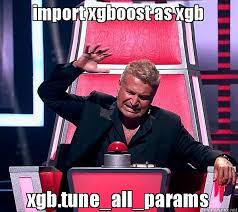

  

About repository: 
This repository contains small projects on classical ML algorithms (linear regression, logistic regression, decision trees and random forests and etc), as well as a full pipeline DL project (EDA, Feature Engineering and NN training).
Also there is a project on Stochastic Gradient Descent for linear and logistic regressions. 

  

  

